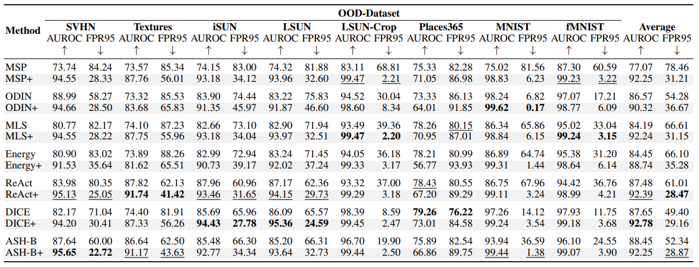
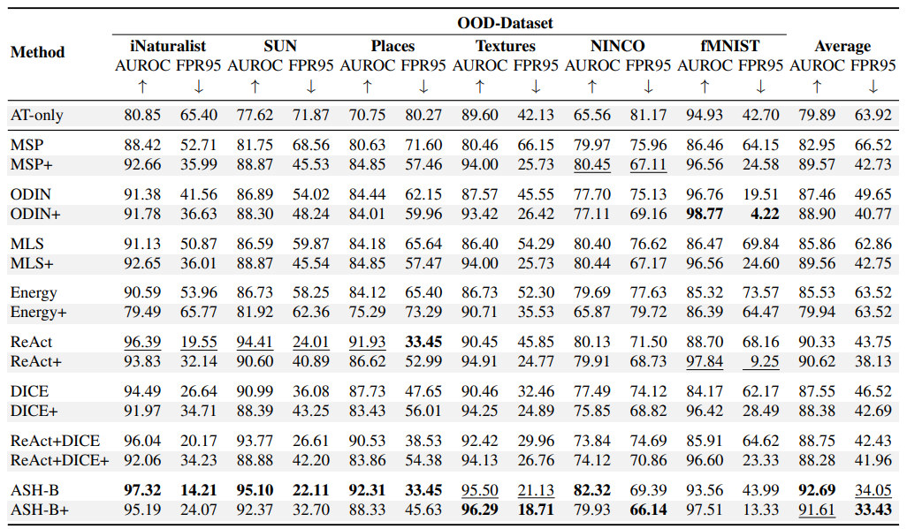

# ATS: Adaptive Temperature Scaling for Enhancing Out-of-Distribution Detection Methods

**A**daptive **T**emperature **S**caling (ATS) is a post-hoc addition to a pretrained network that combines
class-agnostic
activations from intermediate layers and class-dependent logits to enhance Out-Of-Distribution (OOD) detection
performance.

This repository provides the code necessary to duplicate the primary findings presented in the paper
**[ATS: Adaptive Temperature Scaling for Enhancing Out-of-Distribution Detection Methods](https://openaccess.thecvf.com/content/WACV2024/html/Krumpl_ATS_Adaptive_Temperature_Scaling_for_Enhancing_Out-of-Distribution_Detection_Methods_WACV_2024_paper.html)**
by Gerhard Krumpl, Henning Avenhaus, Horst Possegger and Horst Bischof.


Fig. 1 Overview of our Adaptive Temperature Scaling (ATS) method:
At test-time (inference), ATS utilizes a per-sample specific temperature derived from the intermediate layer activation
to scale the logits.
The per-sample temperature uses the empirical cumulative distribution function (eCDF), which is precomputed on the
training set in the calibration phase.
ATS can be seamlessly combined with various OOD detection methods that leverage their OOD score from the logits,
effectively enhancing the distinguishability between in-distribution (ID) and out-of-distribution (OOD) samples.

**Contact**
Should you have any queries, issues, or feedback, feel free to reach out
to [Gerhard Krumpl](mailto:gerhard.krumpl@icg.tugraz.at).

In the coming weeks we will provide the code for the experiments and the pretrained models.

## OOD Detection Results
ATS enhances the detection of OOD performance effectively on both small-scale and large-scale benchmarks.


Table 1 Performance of OOD detection methods for a ResNet18 backbone trained on CIFAR-100.


Table 2 Performance of OOD detection methods for a ResNet50 backbone trained on ImageNet-1K.

## TODO

- [ ] Add code for experiments
- [ ] Add pretrained models

## Citation

If you use our codebase, please cite our work:

```
@InProceedings{Krumpl_2024_WACV,
    author    = {Krumpl, Gerhard and Avenhaus, Henning and Possegger, Horst and Bischof, Horst},
    title     = {ATS: Adaptive Temperature Scaling for Enhancing Out-of-Distribution Detection Methods},
    booktitle = {Proceedings of the IEEE/CVF Winter Conference on Applications of Computer Vision (WACV)},
    month     = {January},
    year      = {2024},
    pages     = {3864-3873}
}
```